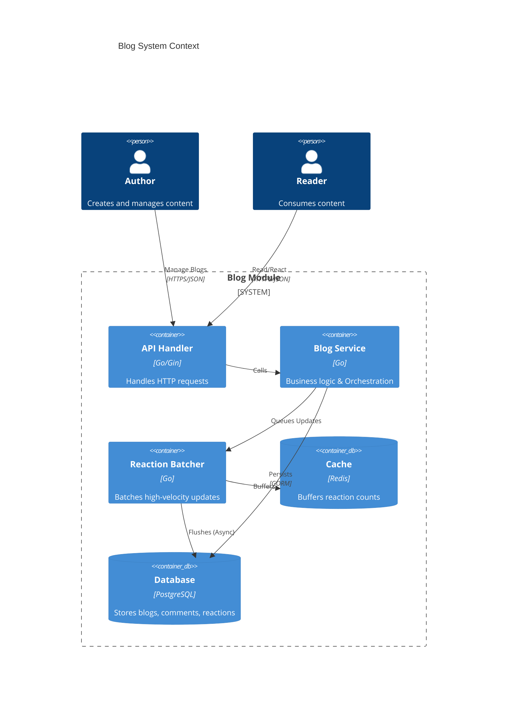
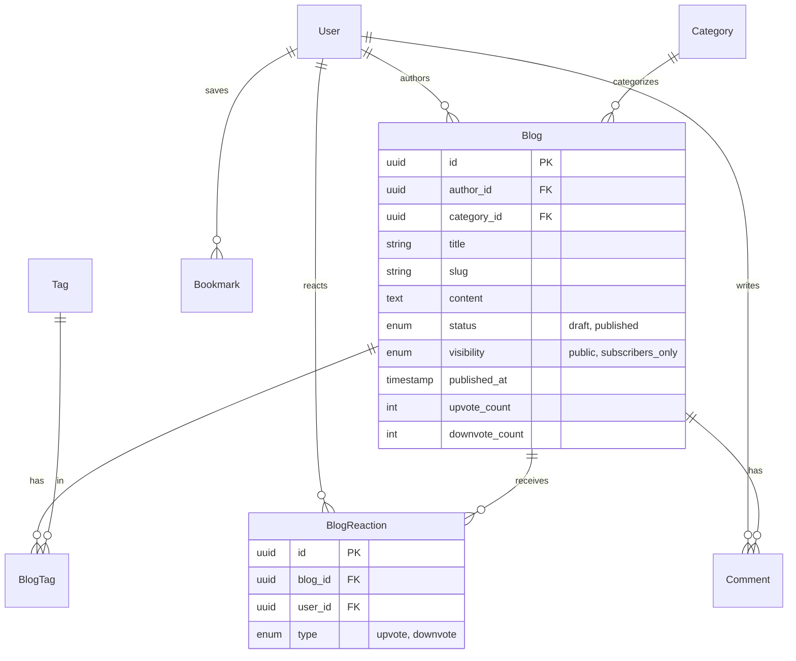
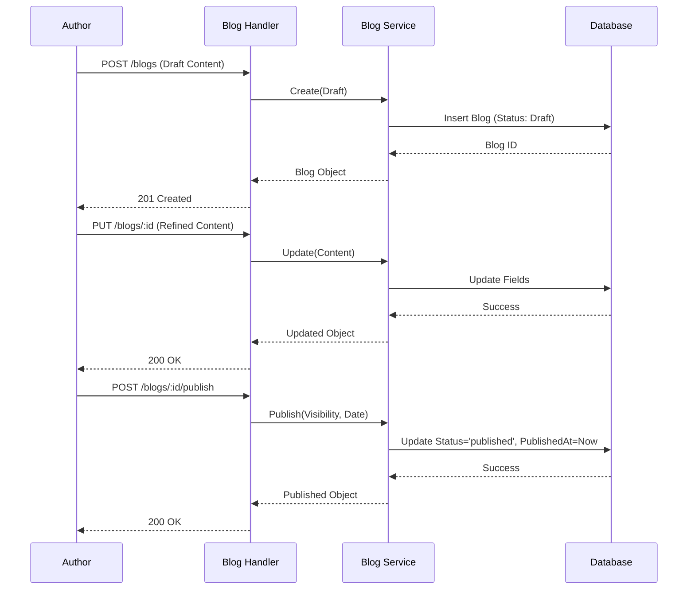
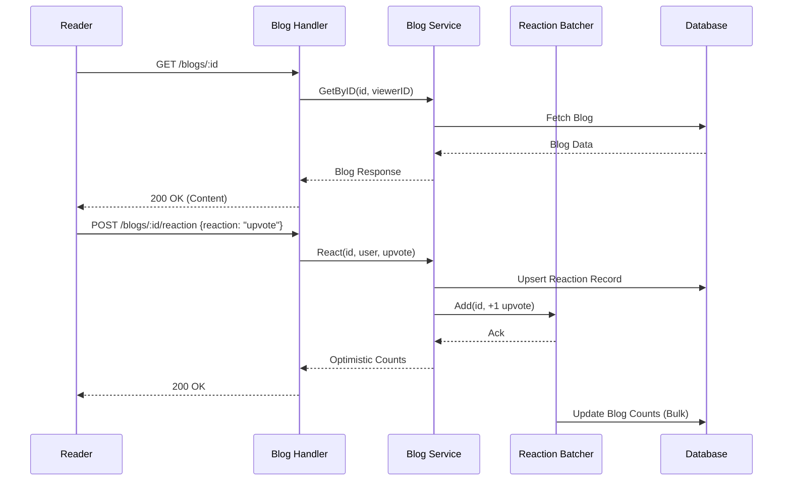

# Blog Module Documentation

## 1. Overview

The Blog module provides functionality for creating, managing, and interacting with long-form content. It supports a full publishing workflow (Draft/Publish), categorization, tagging, and user engagement features (Comments, Reactions, Bookmarks).

## 2. Architecture

The module follows a Clean Architecture pattern, separating concerns into layers:

- **Handler (Interface)**: HTTP request handling and validation.
- **Service (Domain/Application)**: Business logic orchestration and domain rules.
- **Repository (Infrastructure)**: Data persistence.

### C4 Container Diagram



## 3. Data Model

The data model centers around the `Blog` entity, with relationships to Users, Categories, and Tags.

### Entity Relationship Diagram (ERD)



## 4. User Flows

### 4.1 Author Publishing Flow

An author creates a draft, updates it, and finally publishes it to make it visible.



### 4.2 Reader Interaction Flow

A reader views a blog post and reacts to it. Reactions are batched via Redis to handle high concurrency.



## 5. API Reference

### Base URL: `/api/v1`

| Method | Endpoint | Description | Auth Required |
|:-------|:---------|:------------|:--------------|
| `GET` | `/blogs` | List blogs with filters (author, category, status) | No |
| `GET` | `/blogs/feed` | Get personalized feed | Yes |
| `GET` | `/blogs/:id` | Get single blog details | Optional |
| `GET` | `/blogs/:id/related` | Get related blogs | Optional |
| `POST` | `/blogs` | Create a new blog (Draft) | Yes |
| `PUT` | `/blogs/:id` | Update blog content | Yes (Author) |
| `DELETE` | `/blogs/:id` | Soft delete blog | Yes (Author) |
| `POST` | `/blogs/:id/publish` | Publish a blog | Yes (Author) |
| `POST` | `/blogs/:id/unpublish`| Revert to draft | Yes (Author) |
| `POST` | `/blogs/:id/reaction` | Upvote, Downvote, or Remove | Yes |
| `POST` | `/blogs/:id/read` | Mark blog as read | Yes |
| `POST` | `/blogs/:id/bookmark` | Bookmark a blog | Yes |
| `DELETE` | `/blogs/:id/bookmark` | Remove bookmark | Yes |
| `POST` | `/blogs/:id/comments` | Add a comment | Yes |

### Reaction Endpoint
**POST** `/blogs/:id/reaction`

**Payload**
```json
{
  "reaction": "upvote"
}
```
*   **reaction**: `upvote`, `downvote`, or `none`. Use `none` to remove an existing reaction.

### Key Data Structures

#### Blog Response
```json
{
  "id": "uuid",
  "authorId": "uuid",
  "title": "My First Blog",
  "slug": "my-first-blog",
  "content": "...",
  "status": "published",
  "author": {
    "id": "uuid",
    "name": "Jane Doe"
  },
  "upvoteCount": 10,
  "createdAt": "2023-10-01T12:00:00Z"
}
```
