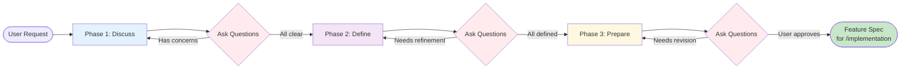

# Brainstorming Workflow

User Request: $1

Collaborative feature discussion and requirement definition. This workflow serves as the **pre-cursor** to the development pipeline.

## When to Use

- When you have a feature idea but need to flesh out the details
- When you need to discuss requirements, edge cases, and user flows
- When you want to prepare a clear feature specification for development
- **Goal**: Turn a rough idea into a structured input for `/implementation`

## Phases



> **⚠️ CRITICAL**: Each phase MUST use `question` tool to ask clarifying questions until ALL concerns are resolved. Do NOT proceed until user explicitly confirms.

### Phase 1: DISCUSS (Context & Scope)

Understand the "Why" and "What".

```
1. Discuss the feature's goal and user value
2. Identify target users and use cases
3. Explore potential technical approaches (high-level)
4. Discuss constraints and non-functional requirements
5. **ASK CLARIFYING QUESTIONS** using question tool
6. **LOOP**: Continue asking until ALL concerns are resolved
```

- Skills: `brainstorming`, `ideation`, `requirement-analysis`
- **Loop Rule**: Must use `question` tool to ask user until no more open questions
- Output: Clear understanding of feature scope (user must confirm)

### Phase 2: DEFINE (Specifics)

Flesh out the "How".

```
1. Define user stories and acceptance criteria
2. Outline key user flows (happy path & edge cases)
3. Identify necessary data models/fields
4. List required API endpoints or interface changes
5. **ASK CLARIFYING QUESTIONS** using question tool
6. **LOOP**: Continue asking until ALL specifics are defined
```

- **Loop Rule**: Must use `question` tool to validate assumptions with user
- Output: Detailed feature points (user must confirm)

### Phase 3: PREPARE (Pipeline Input)

Structure the output for the development pipeline.

```
1. Summarize the feature into a structured format
2. Create a "Feature Request" document
3. Ensure all inputs required by /implementation (Architect) are present
4. **PRESENT TO USER** and ask for confirmation using question tool
5. **LOOP**: Revise based on feedback until user approves
```

- **Loop Rule**: Must get explicit user approval before proceeding to `/implementation`
- Output: A structured **Feature Specification** ready for `/implementation`

## Output Format (for /develop)

The final output should be a clear prompt/document containing:

```markdown
# Feature: [Feature Name]

## Objective

[Brief description of what we are building and why]

## Requirements

- [ ] Requirement 1
- [ ] Requirement 2

## Technical Context

- Impacted Services: [List]
- New Data/Fields: [Brief list]

## Acceptance Criteria

1. User can...
2. System should...
```

## Integration

```
/brainstorm (This Workflow) ──▶ Output: Feature Spec ──▶ /implementation (Architect Phase)
```

Use `/brainstorm` to **talk** about the feature.
Use `/implementation` to **build** the feature (after requirements are clear).
