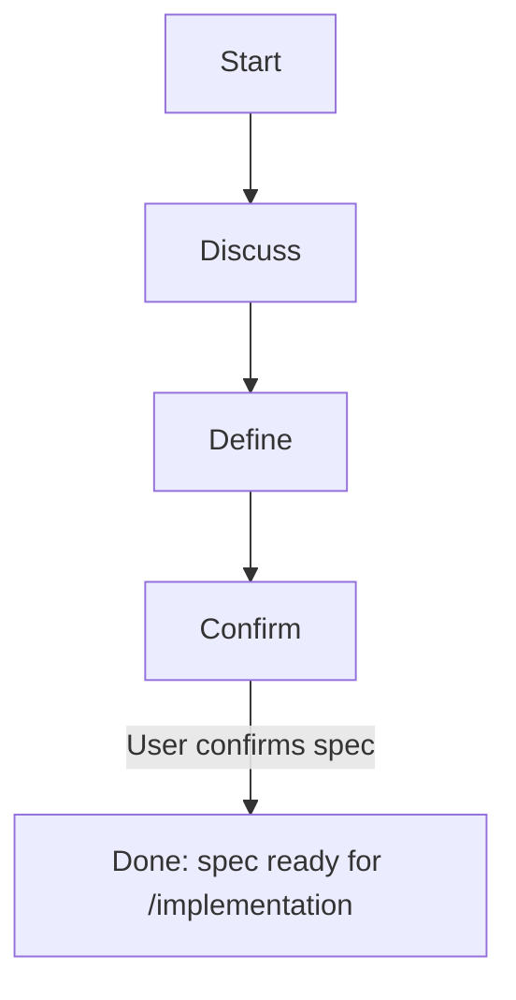

# Brainstorm workflow

Input: $1

Use this workflow when you have an idea but not a spec yet. Your goal is to
produce a short feature spec that is ready for `/implementation`.

## Execution note

Run this workflow with the `@brainstormer` agent by default. For larger or
code-heavy topics, `@brainstormer` can spawn multiple `@explore` agents in
parallel to search relevant parts of the codebase.

## Workflow diagram

This diagram shows the high-level flow and where the workflow ends.


```mermaid
flowchart TD
  A[Start] --> B[Discuss]
  B --> C[Define]
  C --> D[Confirm]
  D -->|User confirms spec| E[Done: spec ready for /implementation]
```

## Steps

1. Discuss
   - Goal and user value
   - In scope and out of scope
   - Constraints (security, performance, deadlines)

2. Define
   - User stories and acceptance criteria
   - Edge cases and failure modes
   - Data and API surface changes (high level)

3. Confirm
   - Ask remaining questions with `question`
   - User explicitly confirms the spec

## Exit criteria

You have a one-page spec with:

- Objective
- Requirements and non-goals
- Acceptance criteria
- Technical context (impacted areas, data changes)

## Minimal spec template

```markdown
# Feature: <name>

## Objective
<what you are building and why>

## Requirements
- [ ] <req>

## Non-goals
- <explicitly out of scope>

## Acceptance criteria
1. <observable behavior>

## Technical context
- Impacted areas: <packages, services, endpoints>
- Data changes: <tables, fields, events>
```

## Suggested skills

- `skill(name="requirement-analysis")`
- `skill(name="brainstorming")`
