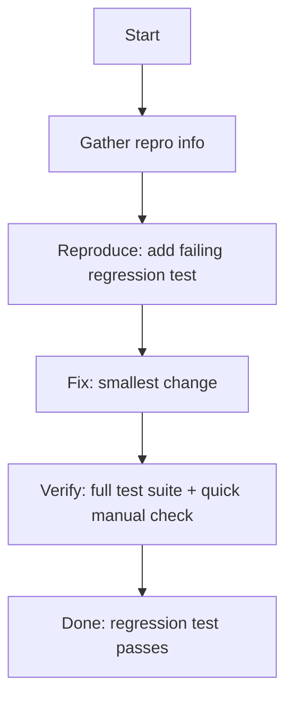

# Bug-fix workflow

Input: $1

Use this workflow for small, contained fixes that do not change API contracts
or database schema.

## Execution note

You can run this workflow as a single agent. If the task is large, you can
optionally spawn specialized subagents via `task(...)` for specific phases.

If the fix needs new endpoints, schema changes, or a behavior contract change,
route to `/develop` (unclear requirements) or `/implementation` (clear spec).

## Workflow diagram

This diagram shows the minimal regression-test-driven loop for bug fixes.

## Steps

1. Gather repro info
   - Steps to reproduce
   - Expected vs actual behavior
   - Logs, stack traces, screenshots

2. Reproduce
   - Add a failing regression test (`*_test.go`) that demonstrates the bug
   - Run it and confirm it fails

3. Fix
   - Apply the smallest change that makes the new test pass

4. Verify
   - Run the full test suite
   - Do a quick manual check if applicable

## Exit criteria

- Regression test exists and passes
- Root cause is identified (one or two sentences)
- Full test suite is green
- No unrelated behavior changes
