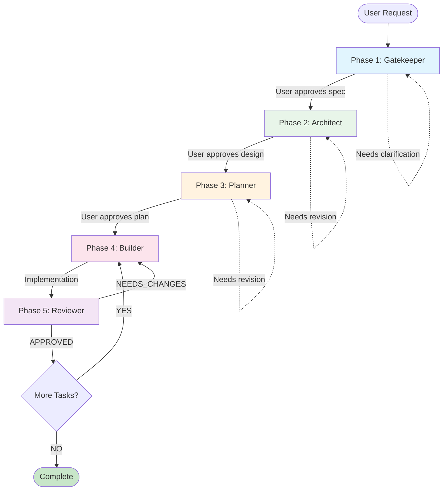

# Development Workflow

User Request: $1

> **Core Principle**: Delegate, don't do. Load agent files and follow their instructions.

## Pipeline Flow



---

## Execution

### Phase 1-3: Sequential (Gatekeeper → Architect → Planner)

Same as before - load agent, follow instructions, wait for approval.

### Phase 4 & 5: Build + Review Loop

```
FOR EACH TASK in plan:
  1. Load Builder agent
     - Input: Task details + API Contract
     - Output: Implementation + Tests
  2. Load Reviewer agent
     - Input: Implementation + Specs
     - Output: APPROVED or NEEDS_CHANGES
  3. IF NEEDS_CHANGES:
     - Builder fixes issues
     - Re-submit to Reviewer (max 3 rounds)
  4. IF APPROVED:
     - Mark task complete
     - Proceed to next task
```

---

## Context Passing

| From         | To           | Context                             |
| ------------ | ------------ | ----------------------------------- |
| Gatekeeper   | Architect    | Refined Spec, Tech Stack            |
| Architect    | Planner      | Schema, API Contract                |
| Planner      | Builder      | Task assignment, Contract reference |
| Builder      | Reviewer     | Implementation, Test results        |
| Reviewer     | Builder      | Feedback (if NEEDS_CHANGES)         |

---

## Rules

1. **Load agent file** before each phase
2. **Never skip approval gates**
3. **Never write code** in Gatekeeper/Architect/Planner
4. **MANDATORY Review** - Every task must pass Reviewer
5. **Max 3 review rounds** - Escalate if issues persist

---

## Error Recovery

| Situation              | Action                                |
| ---------------------- | ------------------------------------- |
| Request unclear        | Gatekeeper asks questions → Loop      |
| User rejects design    | Architect revises → Loop              |
| User rejects plan      | Planner revises → Loop                |
| Review fails           | Builder fixes → Re-submit (max 3)     |
| 3 rounds exceeded      | Escalate to user                      |
