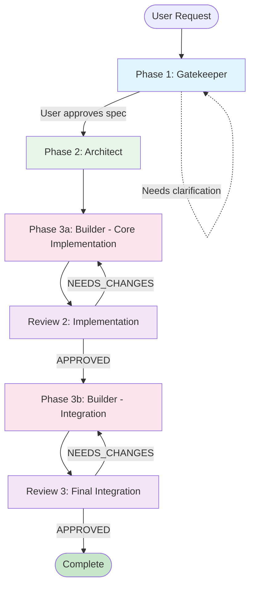

# Development Workflow

User Request: $1

> **Core Principle**: Delegate, don't do. Use token-efficient review gates and self-verifying agents.

## Pipeline Flow (Contract First - Optimized)

```mermaid
flowchart TB
    Start([User Request]) --> Gatekeeper[Phase 1: Gatekeeper]
    
    Gatekeeper -->|User approves spec| Architect[Phase 2: Architect]
    Gatekeeper -.->|Needs clarification| Gatekeeper
    
    Architect --> BuilderP2[Phase 3a: Builder - Core Implementation]
    
    BuilderP2 --> ReviewerImpl[Review 2: Implementation]
    ReviewerImpl -->|APPROVED| BuilderP3[Phase 3b: Builder - Integration]
    ReviewerImpl -->|NEEDS_CHANGES| BuilderP2
    
    BuilderP3 --> ReviewerInt[Review 3: Final Integration]
    ReviewerInt -->|APPROVED| Complete([Complete])
    ReviewerInt -->|NEEDS_CHANGES| BuilderP3

    style Gatekeeper fill:#e1f5fe
    style Architect fill:#e8f5e9
    style BuilderP2 fill:#fce4ec
    style ReviewerImpl fill:#f3e5f5
    style BuilderP3 fill:#fce4ec
    style ReviewerInt fill:#f3e5f5
    style Complete fill:#c8e6c9
```

---

## Execution (Token-Efficient)

### Phase 1: Gatekeeper
- Load agent, refine requirements, obtain user approval on spec.
- **Output**: Formal Feature Specification.

### Phase 2: Architect
- **Architect**: Design contracts and phase-based plan.
- **Self-Review**: Verify plan and SOLID boundaries. Directly hands off to Phase 3.

### Phase 3: Builder Implementation (2 Phases + 2 Reviews)
- **Phase 3a (Core)**: Builder implements logic + Unit tests.
- **Review 2**: Reviewer performs **Diff-Only** review.
- **Phase 3b (Integration)**: Builder wires components + Integration/E2E tests.
- **Review 3**: Final verification of acceptance criteria.

---

## Token Safety Rules

1. **Lazy Loading**: Reviewer agent should ONLY load the `consolidated-review` skill.
2. **Diff-Based Review**: Reviewer uses `git diff` and `serena` to read only modified symbols/lines.
3. **Session Re-use**: Use `task_id` to maintain subagent context across rounds.
4. **Self-Review**: Builder must verify against `Clean Code Checklist` before handoff.

---

## Error Recovery

| Situation                 | Action                                    |
| ------------------------- | ----------------------------------------- |
| Request unclear           | Gatekeeper asks questions → Loop          |
| Plan rejected by user     | Architect revises contracts → Loop        |
| Implementation fails      | Builder fixes → Re-submit Phase 3a        |
| Integration fails         | Builder fixes → Re-submit Phase 3b        |
| 3 rounds exceeded         | Escalate to user                          |
