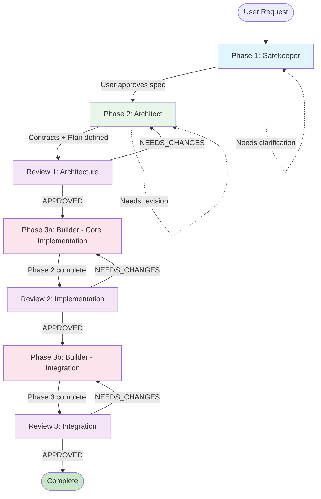

# Development Workflow

User Request: $1

> **Core Principle**: Delegate, don't do. Load agent files and follow their instructions.

## Pipeline Flow (Contract First - 3 Reviews)



---

## Execution

### Phase 1-2: Sequential (Gatekeeper → Architect → Review)

#### Phase 1: Gatekeeper
Load agent, follow instructions, wait for user approval on spec.

#### Phase 2: Architect
Load agent to design contracts and create phase-based plan.

**Architect Output**:
- Phase 1: Interface Definition (Contracts) - ✅ Done by Architect
- Phase 2: Core Implementation tasks - For Builder
- Phase 3: Integration tasks - For Builder

#### Review 1: Architecture Review
```
1. Load Reviewer agent
   - Input: Contracts + Plan from Architect
   - Check: Interface consistency, SOLID principles, plan viability
   - Output: APPROVED or NEEDS_CHANGES
2. IF NEEDS_CHANGES:
   - Return to Architect for revision
   - Re-submit to Reviewer (max 3 rounds)
3. IF APPROVED:
   - Proceed to Phase 3a
```

### Phase 3: Builder Implementation (2 Phases + 2 Reviews)

#### Phase 3a: Core Implementation
```
1. Load Builder agent
   - Input: Phase 2 tasks + Component Interfaces
   - Output: Implemented components + Unit tests
```

#### Review 2: Implementation Review
```
1. Load Reviewer agent
   - Input: Component implementations
   - Check: Tests pass, follows interfaces, code quality
   - Output: APPROVED or NEEDS_CHANGES
2. IF NEEDS_CHANGES:
   - Return to Builder for fixes
   - Re-submit to Reviewer (max 3 rounds)
3. IF APPROVED:
   - Proceed to Phase 3b
```

#### Phase 3b: Integration
```
1. Load Builder agent
   - Input: Phase 3 tasks + Approved components
   - Output: Wired components + Integration/E2E tests
```

#### Review 3: Integration Review
```
1. Load Reviewer agent
   - Input: Complete feature
   - Check: Integration tests, E2E tests, acceptance criteria
   - Output: APPROVED or NEEDS_CHANGES
2. IF NEEDS_CHANGES:
   - Return to Builder for fixes
   - Re-submit to Reviewer (max 3 rounds)
3. IF APPROVED:
   - Feature complete
```

---

## Context Passing

| From         | To           | Context                              |
| ------------ | ------------ | ------------------------------------ |
| Gatekeeper   | Architect    | Refined Spec, Tech Stack             |
| Architect    | Builder      | Task assignment, Contract reference  |
| Builder      | Reviewer     | Implementation, Test results         |
| Reviewer     | Builder      | Feedback (if NEEDS_CHANGES)          |

---

## Rules

1. **Load agent file** before each phase
2. **Never skip approval gates**
3. **Never write code** in Gatekeeper/Architect
4. **MANDATORY Review** - Every task must pass Reviewer
5. **Max 3 review rounds** - Escalate if issues persist

---

## Error Recovery

| Situation                 | Action                                    |
| ------------------------- | ----------------------------------------- |
| Request unclear           | Gatekeeper asks questions → Loop          |
| User rejects design       | Architect revises → Loop                  |
| User rejects plan         | Architect revises → Loop                  |
| Architecture review fails | Architect revises contracts → Loop        |
| Implementation review fails| Builder fixes → Re-submit Phase 2        |
| Integration review fails  | Builder fixes → Re-submit Phase 3         |
| 3 rounds exceeded         | Escalate to user                          |
