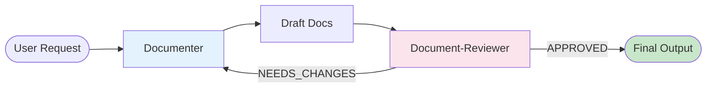

# Document Workflow

**Trigger**: `/document $1` command

**Arguments**:
- `$1`: The target to document (e.g., "auth flow", "User model", "system architecture")

**Goal**: Create or Update documentation on demand.

## Flow

## Steps

### 1. Generation/Update Phase

- **Agent**: `documenter`
- **Input**: `$1` (scope)
- **Action**: 
  - Analyze code based on scope.
  - Check if docs already exist (Update) or need creation (Create).
  - Generate/Edit documentation (Markdown/Mermaid).
- **Output**: Draft files in `.agent/temp/docs/` or modified existing files.

### 2. Review Phase

- **Agent**: `document-reviewer`
- **Action**: Verify the draft against the codebase using CKB.
- **Input**: Draft files + Original User Request.
- **Output**: `APPROVED` or `NEEDS_CHANGES`.

### 3. Loop (if needed)

- If `NEEDS_CHANGES`:
  - Pass feedback back to `documenter`.
  - `documenter` regenerates/fixes.
  - Return to Step 2.
- **Limit**: Max 3 loops.

### 4. Finalize

- If `APPROVED`:
  - Move/Save files to final destination (e.g., `docs/`).
  - Report success to user.
