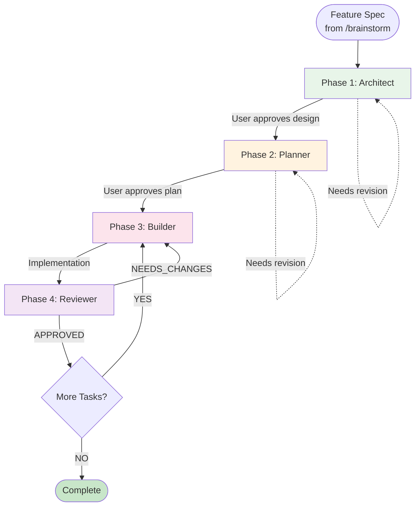

# Implementation Workflow

User Request: $1

> **Core Principle**: Skip requirement refinement, go straight to technical design and implementation.

> **Use Case**: When requirements are already well-defined (e.g., from /brainstorm output)

## Workflow Flow



---

## Execution

### Phase 1-2: Sequential (Architect → Planner)

Load agent, follow instructions, wait for approval.

### Phase 3 & 4: Build + Review Loop

```
FOR EACH TASK in plan:
  1. Load Builder agent
     - Input: Task details + API Contract
     - Output: Implementation + Tests
  2. Load Reviewer agent
     - Input: Implementation + Specs
     - Output: APPROVED or NEEDS_CHANGES
  3. IF NEEDS_CHANGES:
     - Builder fixes issues
     - Re-submit to Reviewer (max 3 rounds)
  4. IF APPROVED:
     - Mark task complete
     - Proceed to next task
```

---

## Context Passing

| From         | To           | Context                             |
| ------------ | ------------ | ----------------------------------- |
| Architect    | Planner      | Schema, API Contract                |
| Planner      | Builder      | Task assignment, Contract reference |
| Builder      | Reviewer     | Implementation, Test results        |
| Reviewer     | Builder      | Feedback (if NEEDS_CHANGES)         |

---

## Rules

1. **Load agent file** before each phase
2. **Never skip approval gates**
3. **Never write code** in Architect/Planner
4. **MANDATORY Review** - Every task must pass Reviewer
5. **Max 3 review rounds** - Escalate if issues persist

---

## Error Recovery

| Situation              | Action                                |
| ---------------------- | ------------------------------------- |
| User rejects design    | Architect revises → Loop              |
| User rejects plan      | Planner revises → Loop                |
| Review fails           | Builder fixes → Re-submit (max 3)     |
| 3 rounds exceeded      | Escalate to user                      |

---

## Comparison with /develop

| Aspect       | /develop                           | /implementation                    |
| ------------ | ---------------------------------- | ---------------------------------- |
| Input        | Raw user request                   | Pre-defined spec (from /brainstorm)|
| Phase 1      | Gatekeeper (requirement analysis)  | Architect (technical design)       |
| When to use  | Unclear requirements               | Clear, well-defined requirements   |
| Prep work    | None needed                        | /brainstorm recommended            |
