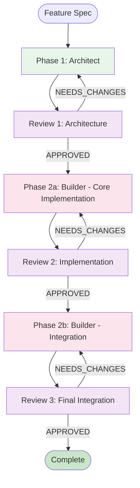

# Implementation Workflow

User Request: $1

> **Core Principle**: Skip requirement refinement, go straight to technical design and implementation.
> **Efficiency**: Diff-based reviews and consolidated quality gates.

## Workflow Flow (Contract First - Optimized)

```mermaid
flowchart TB
    Start([Feature Spec]) --> Architect[Phase 1: Architect]
    
    Architect --> ReviewerArch[Review 1: Architecture]
    ReviewerArch -->|APPROVED| BuilderP2[Phase 2a: Builder - Core Implementation]
    ReviewerArch -->|NEEDS_CHANGES| Architect
    
    BuilderP2 --> ReviewerImpl[Review 2: Implementation]
    ReviewerImpl -->|APPROVED| BuilderP3[Phase 2b: Builder - Integration]
    ReviewerImpl -->|NEEDS_CHANGES| BuilderP2
    
    BuilderP3 --> ReviewerInt[Review 3: Final Integration]
    ReviewerInt -->|APPROVED| Complete([Complete])
    ReviewerInt -->|NEEDS_CHANGES| BuilderP3

    style Architect fill:#e8f5e9
    style ReviewerArch fill:#f3e5f5
    style BuilderP2 fill:#fce4ec
    style ReviewerImpl fill:#f3e5f5
    style BuilderP3 fill:#fce4ec
    style ReviewerInt fill:#f3e5f5
    style Complete fill:#c8e6c9
```

---

## Execution (Token-Efficient)

### Phase 1: Architect → Architecture Review
1. **Architect**: Design contracts and phase-based plan.
2. **Reviewer**: 
   - Load `consolidated-review`.
   - Verify plan viability and SOLID boundaries.
   - **Tip**: For small tasks, Reviewer can auto-approve if Architect output is precise.

### Phase 2: Implementation (RED-GREEN-REFACTOR)
1. **Builder**: Core logic + Unit tests.
   - **Self-Review**: Builder must run its own checklist before handoff.
2. **Reviewer**:
   - **Diff-Only Review**: Use `git diff` to identify changes; use `serena` to read only modified symbols.
   - Verify TDD (check that tests pass and cover logic).

### Phase 3: Integration & Final Review
1. **Builder**: Wiring + Integration/E2E tests.
2. **Reviewer**: 
   - Verify end-to-end functionality.
   - **Optimization**: For low-complexity features, this gate can be combined with Review 2.

---

## Token Safety Rules

1. **Lazy Loading**: Reviewer agent should NOT read files it doesn't need.
2. **Diff-Based Input**: Do not pass the whole file content to Reviewer. Use `serena_find_symbol` for specific symbols.
3. **Consolidated Skill**: Never load old individual skills (`code-review`, etc.). Load ONLY `consolidated-review`.
4. **Context Preservation**: Re-use `task_id` for subagents to maintain session memory without re-sending full context.

---

## Error Recovery

| Situation                 | Action                                    |
| ------------------------- | ----------------------------------------- |
| Architecture review fails | Architect revises contracts → Loop        |
| Implementation fails      | Builder fixes → Re-submit Phase 2        |
| Integration fails         | Builder fixes → Re-submit Phase 3         |
| 3 rounds exceeded         | Escalate to user                          |
