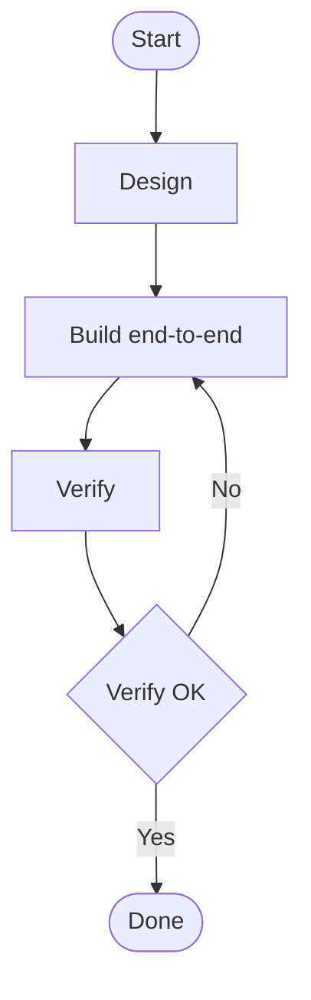

# Implementation workflow

Input: $1 (feature spec)

Use this workflow when the spec is already approved. Skip requirement discovery
and go straight to design and implementation.

## Execution note

You can run this workflow as a single agent. If the task is large, you can
optionally spawn specialized subagents via `task(...)` for specific phases.

## How to run subagents (minimal)

- Design: `task(subagent_type="architect", description="Design", prompt="...")`
- Build: `task(subagent_type="builder", description="Build", prompt="...")`
- Continue: `task(task_id="<id>", subagent_type="<same>", description="...", prompt="...")`
- Load a skill: `skill(name="<skill>")`
- Ask one blocking question: `question(...)`

## Workflow diagram

This diagram shows the fast path from an approved spec to production-ready code.

```mermaid
flowchart TD
  start([Start]) --> design[Design]
  design --> build[Build end-to-end]
  build --> verify[Verify]
  verify --> ok{Verify OK}
  ok -- Yes --> done([Done])
  ok -- No --> build
```

## Flow

Follow these steps to go from an approved spec to production-ready code with a
minimal back-and-forth.

1. Design (architect)
   - Define contracts and a phased plan.
   - Define the test plan and risks.

2. Build end-to-end (builder)
    - Implement the core logic with unit tests.
    - Wire integration points (routes, DB, cache, config).
    - Add integration or end-to-end tests when needed.
    - Run the full test suite and any local checks used in this repo.

3. Verify
     - Verify acceptance criteria and that the test suite is adequate.
     - Validate Clean Architecture boundaries and error handling.
     - Run the full test suite and any local checks used in this repo.
     - If verification is not OK, go back to Build, apply fixes, and verify again.

## Token rules

- Do not paste full files unless necessary.
- Reuse `task_id` for follow-ups.
