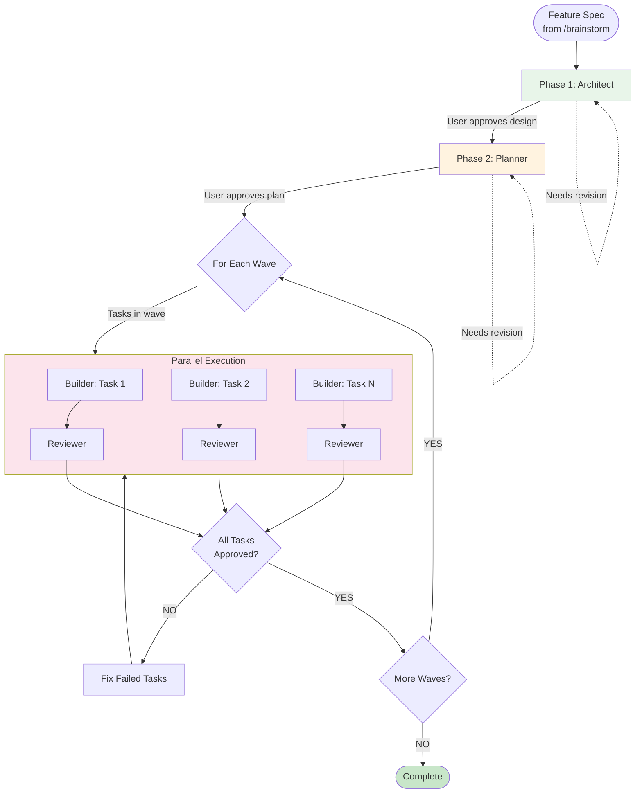

# Implementation Workflow

User Request: $1

> **Core Principle**: Skip requirement refinement, go straight to technical design and implementation.

> **Use Case**: When requirements are already well-defined (e.g., from /brainstorm output)

## Workflow Flow



---

## Execution

### Phase 1-2: Sequential (Architect → Planner)

Load agent, follow instructions, wait for approval.

### Phase 3 & 4: Parallel Build + Review

```
FOR EACH WAVE in plan:
  1. Get tasks for this wave
  2. Calculate builder_count = min(tasks_in_wave, 2)
  3. Spawn builder_count Builder agents IN PARALLEL
     - Each Builder handles one task
     - Use Task tool with parallel invocations
  4. WAIT for ALL Builders to complete
  5. FOR EACH completed task:
     - Load Reviewer agent
     - Review the task
     - If NEEDS_CHANGES → Builder fixes → Re-review (max 3 rounds)
  6. ALL tasks in wave APPROVED?
     - YES → Proceed to next wave
     - NO → Fix remaining tasks → Loop
  7. After all waves complete → Return to user
```

### Parallel Execution Example

```
Wave 1 has 3 tasks:
  → Spawn 3 Builders in parallel (single message, 3 Task tool calls)
  → Wait for all 3 to complete
  → Review each task
  → All approved → Move to Wave 2

Wave 2 has 2 tasks:
  → Spawn 2 Builders in parallel
  → Wait for both to complete
  → Review each task
  → All approved → Move to Wave 3
```

---

## Context Passing

| From         | To           | Context                             |
| ------------ | ------------ | ----------------------------------- |
| Architect    | Planner      | Schema, API Contract                |
| Planner      | Orchestrator | Todo List with Waves, Builder count |
| Orchestrator | Builders     | Task assignment, Contract reference |
| Builder      | Reviewer     | Implementation, Test results        |
| Reviewer     | Builder      | Feedback (if NEEDS_CHANGES)         |

---

## Rules

1. **Load agent file** before each phase
2. **Never skip approval gates**
3. **Never write code** in Architect/Planner
4. **Parallel within waves** - Tasks in same wave run in parallel
5. **Sequential between waves** - Wait for wave N before starting wave N+1
6. **Max 5 Builders per wave** - Prevent resource exhaustion
7. **MANDATORY Review** - Every task must pass Reviewer
8. **Max 3 review rounds** - Escalate if issues persist

---

## Error Recovery

| Situation              | Action                                |
| ---------------------- | ------------------------------------- |
| User rejects design    | Architect revises → Loop              |
| User rejects plan      | Planner revises → Loop                |
| One task fails in wave | Other tasks continue, fix failed task |
| Review fails           | Builder fixes → Re-submit (max 3)     |
| 3 rounds exceeded      | Escalate to user                      |

---

## Comparison with /develop

| Aspect       | /develop                           | /implementation                    |
| ------------ | ---------------------------------- | ---------------------------------- |
| Input        | Raw user request                   | Pre-defined spec (from /brainstorm)|
| Phase 1      | Gatekeeper (requirement analysis)  | Architect (technical design)       |
| When to use  | Unclear requirements               | Clear, well-defined requirements   |
| Prep work    | None needed                        | /brainstorm recommended            |
