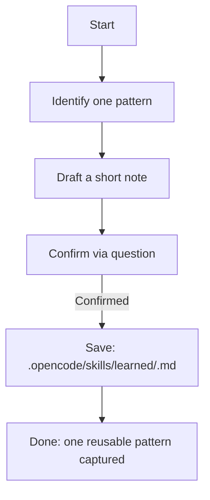

# Learn workflow

Trigger: `/learn`

Use this workflow after a non-trivial session to save one reusable pattern.

## Execution note

You can run this workflow as a single agent. If the task is large, you can
optionally spawn specialized subagents via `task(...)` for specific phases.

## Workflow diagram

This diagram shows how a session insight becomes a reusable note.

## Steps

1. Identify one pattern
   - Error resolution pattern, debugging technique, workaround, or convention
   - Avoid one-off incidents and trivial fixes

2. Draft a short note
   - Save to: `.opencode/skills/learned/<pattern-name>.md`
   - Include: context, problem, solution, example, when to use

3. Confirm and save
   - Ask for confirmation via `question` before writing the final file

## Exit criteria

- One focused note that is reusable in future sessions
