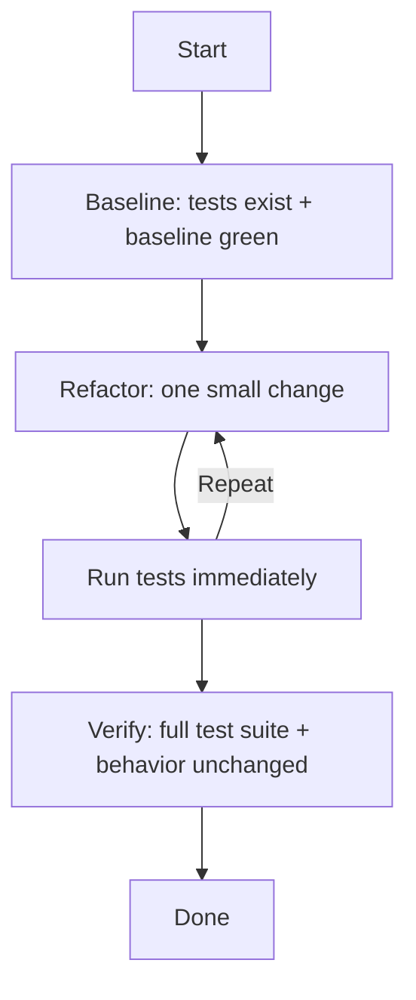

# Refactor workflow

Input: $1

Use this workflow for behavior-preserving changes (cleanup, readability,
performance improvements without contract changes).

## Execution note

You can run this workflow as a single agent. If the task is large, you can
optionally spawn specialized subagents via `task(...)` for specific phases.

## Workflow diagram

This diagram shows the safety-first refactoring loop.

## Steps

1. Baseline
   - Ensure tests exist for the area you will change
   - Run tests and confirm the baseline is green

2. Refactor loop
   - Make one small change
   - Run tests immediately
   - Repeat

3. Verify
   - Run the full test suite
   - Confirm behavior is unchanged

## Notes

- If tests are missing, write tests first.
- Commit only if the user asked for commits in this session.
- Avoid destructive git commands; prefer small, reversible edits.
