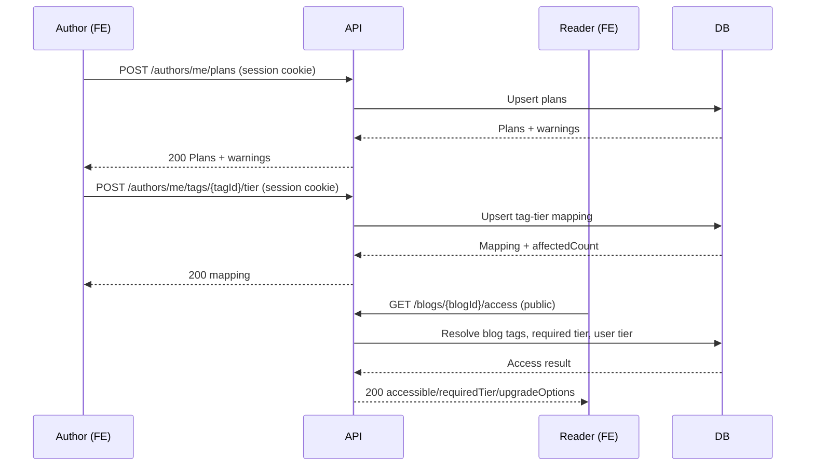

# Plan Feature (Subscription Tiers) - Flow, FE Integration, User Story

## Overview

The Plan feature lets an author define subscription pricing tiers (BRONZE, SILVER, GOLD), assign tags to tier requirements, and let readers check access to a blog post. Access is determined by the highest required tier of the blog's tags. If a reader is blocked, the API returns upgrade options.

Tiers:
- FREE (implicit, not created via plans)
- BRONZE
- SILVER
- GOLD

## API Surface

Author plan management (requires session cookie `session_id`):
- `POST /api/v1/authors/me/plans`
- `POST /api/v1/authors/me/tags/{tagId}/tier`
- `DELETE /api/v1/authors/me/tags/{tagId}/tier`
- `GET /api/v1/authors/me/tag-tiers`

Public access:
- `GET /api/v1/authors/{authorId}/plans`
- `GET /api/v1/blogs/{blogId}/access`

## Flow (Sequence)



## FE Integration Guide

### 1) Author manages plans

Create or update plans for tiers. Only `BRONZE`, `SILVER`, `GOLD` are accepted.

```http
POST /api/v1/authors/me/plans
Cookie: session_id=...
Content-Type: application/json

{
  "plans": [
    { "tier": "BRONZE", "price": "2.99", "name": "Bronze", "description": "Starter" },
    { "tier": "SILVER", "price": "5.99", "name": "Silver", "description": "Standard" },
    { "tier": "GOLD", "price": "9.99", "name": "Gold", "description": "Premium" }
  ]
}
```

Notes:
- Price must be `>= 0`.
- The service returns `warnings` if the price hierarchy is not increasing (`BRONZE < SILVER < GOLD`). It does not block the save.
- `durationDays` is currently fixed to `30`.

### 2) Author assigns tag tier requirements

```http
POST /api/v1/authors/me/tags/{tagId}/tier
Cookie: session_id=...
Content-Type: application/json

{ "requiredTier": "SILVER" }
```

Notes:
- `requiredTier` must be `BRONZE`, `SILVER`, or `GOLD`. `FREE` is not allowed for tag assignment.
- The tag must exist and be used by the author in at least one blog.

### 3) Reader checks access to a blog

```http
GET /api/v1/blogs/{blogId}/access
```

Response shape:
```json
{
  "accessible": false,
  "userTier": "FREE",
  "requiredTier": "SILVER",
  "reason": "",
  "upgradeOptions": [
    {
      "tier": "SILVER",
      "price": "5.99",
      "durationDays": 30,
      "planId": "..."
    }
  ]
}
```

Notes:
- `reason` is currently not set by the service (empty string).
- For anonymous users, `upgradeOptions` includes all active plans for the author.
- For signed-in users who are blocked, `upgradeOptions` includes only plans at or above `requiredTier`.

### 4) Reader initiates payment (upgrade path)

Use `planId` from `upgradeOptions` to create a payment.

```http
POST /api/v1/payments
Cookie: session_id=...
Content-Type: application/json

{
  "userId": "current-user-id",
  "amount": "5.99",
  "type": "SUBSCRIPTION",
  "gateway": "SEPAY",
  "targetId": "author-id",
  "planId": "plan-id"
}
```

The payment flow and webhook processing are in the payment feature. The plan feature only supplies `planId` and pricing for upgrades.

## User Stories

1. As an author, I can define BRONZE/SILVER/GOLD plans so I can monetize my content.
2. As an author, I can assign tags to tiers so content with premium tags is gated.
3. As a reader, I can check whether a blog is accessible before reading it.
4. As a blocked reader, I can see upgrade options to gain access.

## Implementation Notes (Backend Truth)

- Required tier for a blog is the highest tier of its tags. If a blog has no tags, the required tier is `FREE`.
- Access is granted when `userTier >= requiredTier`.
- `/api/v1/blogs/{blogId}/access` is public and does not run `sessionAuth`. The handler only reads `userID` if it exists in context. As implemented today, logged-in users won’t get their tier applied on this endpoint unless another middleware sets `userID`.
