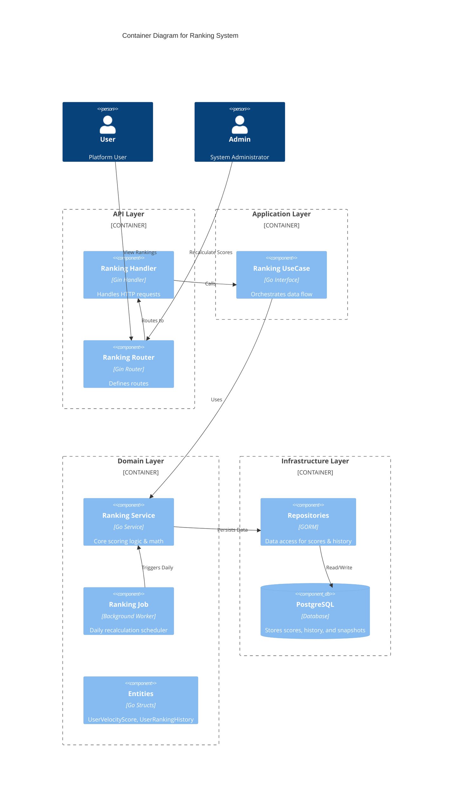
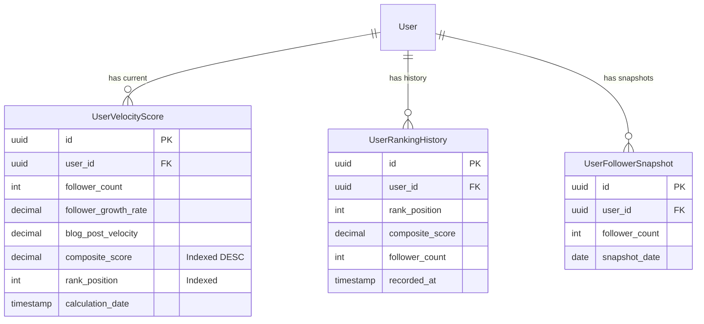

# Ranking System Documentation

## Overview

The Ranking System is designed to identify and highlight trending users based on their activity velocity and audience growth. Unlike static metrics (e.g., total followers), this system emphasizes **momentum**—rewarding users who are actively growing and contributing content.

## Architecture

The system follows a Clean Architecture pattern with distinct layers for HTTP handling, business logic (Use Cases/Services), and data persistence.



## Data Models

The system tracks current velocity scores, historical rankings, and follower snapshots for growth calculation.



## Scoring Logic

The core value proposition is the **Velocity Score**, which identifies trending users.

### Formula
The `CompositeScore` is calculated using a weighted average of two factors:

```
CompositeScore = (FollowerGrowthRate * 0.6) + (BlogPostVelocity * 0.4)
```

| Factor | Weight | Description |
| :--- | :--- | :--- |
| **Follower Growth Rate** | 60% | Percentage growth of followers over the last 30 days. |
| **Blog Post Velocity** | 40% | Average number of blog posts per day over the last 30 days. |

### Calculations

1.  **Follower Growth Rate**:
    *   Window: Last 30 days.
    *   Logic:
        *   If `PreviousFollowers < 100`: Use normalized absolute growth (`Growth / 100`).
        *   If `PreviousFollowers >= 100`: Use percentage growth (`(Current - Previous) / Previous`).
    *   **Cap**: Growth rate is capped at **10.0 (1000%)** to prevent gaming by new accounts with small baselines.

2.  **Blog Post Velocity**:
    *   Window: Last 30 days.
    *   Formula: `TotalPostsInWindow / 30`.

## Background Job (Daily Recalculation)

Ranking is not real-time; it is updated daily to ensure stability and reduce database load.

**Job Flow:**
1.  **Archive**: Snapshot current ranks into `user_ranking_history` table.
2.  **Calculate**: Compute new velocity scores for ALL users based on fresh data.
3.  **Assign**: Sort users by `CompositeScore` (descending) and assign new `RankPosition`.

## API Reference

### 1. Get Trending Users
Returns a paginated list of users sorted by their Velocity Score.

*   **Endpoint**: `GET /api/v1/rankings/trending`
*   **Parameters**:
    *   `page` (int, default 1)
    *   `pageSize` (int, default 20)
*   **Response**:
    ```json
    {
      "data": [
        {
          "id": "uuid",
          "username": "jdoe",
          "compositeScore": 8.5,
          "rank": 1,
          "followerGrowthRate": 0.5,
          "blogPostVelocity": 0.2
        }
      ],
      "meta": { ... }
    }
    ```

### 2. Get Top Users
Currently an alias for "Trending" (Velocity Score), but intended for "Total Followers" ranking.

*   **Endpoint**: `GET /api/v1/rankings/top`

### 3. Get User Ranking Detail
Returns detailed metrics and ranking history for a specific user.

*   **Endpoint**: `GET /api/v1/rankings/users/:userId`
*   **Response**:
    ```json
    {
      "userId": "uuid",
      "rank": 5,
      "previousRank": 8,
      "rankChange": 3,
      "history": [
        { "rankPosition": 8, "recordedAt": "2023-10-01..." },
        { "rankPosition": 12, "recordedAt": "2023-09-30..." }
      ]
    }
    ```

### 4. Recalculate Scores (Admin)
Manually triggers the daily ranking job.

*   **Endpoint**: `POST /api/v1/rankings/recalculate`
*   **Auth**: Bearer Token (Admin Role Required)
